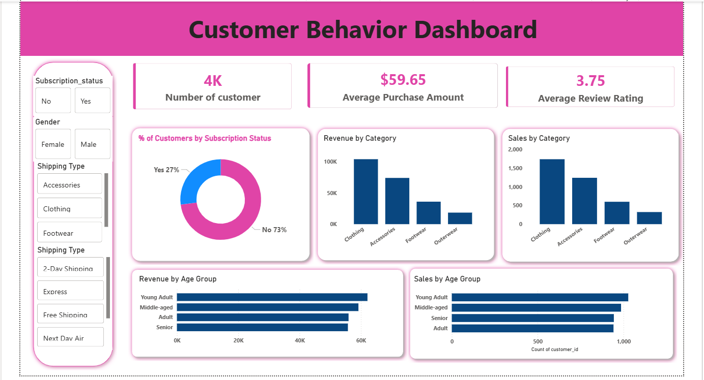

# Customer Behavior Analysis

This is a data analytics project that analyzes customer shopping behavior using Python, SQL, and Power BI.  
The goal of the project is to understand customer spending patterns, product performance, and generate useful business insights.

---

## 🛠 Tools Used

- Python  
- Pandas  
- SQL / MySQL  
- Power BI  

---

## 📊 Dashboard Preview

---

## 📂 Project Files

- **Customer_Shopping_Behavior_Analysis.ipynb** – Python analysis and EDA  
- **project.sql** – SQL queries for business insights  
- **Data Analytics Project (customer).pbix** – Power BI dashboard  
- **Customer Shopping Behavior Analysis.pdf** – Project report  

---

## 📈 Key Insights

- Analysis of customer purchase behavior  
- Product category performance insights  
- Customer segmentation based on purchase history  
- Revenue comparison across customer groups  
- Impact of discounts and subscriptions on spending  

---

## 👨‍💻 Author

Athang Jadhav  
Aspiring Data Analyst
